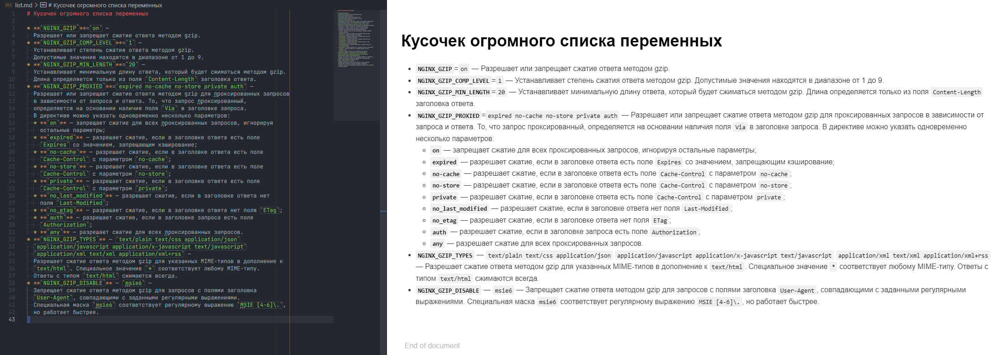
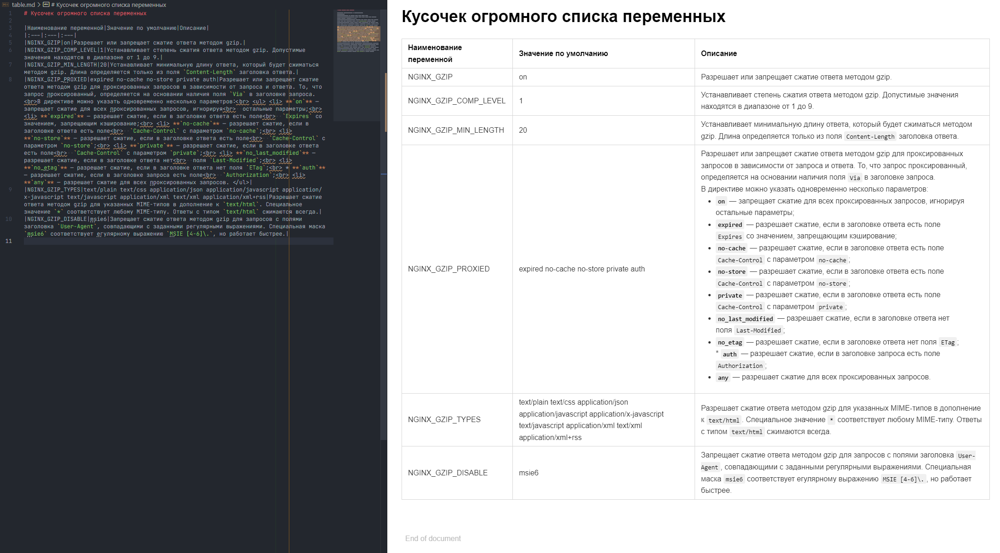
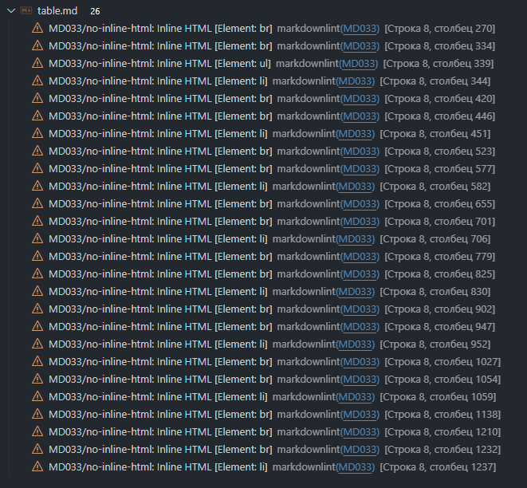
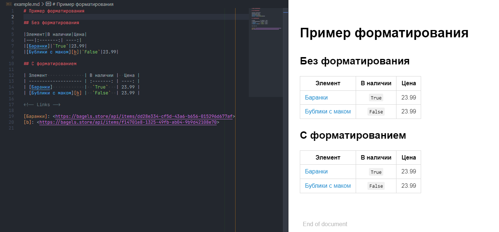
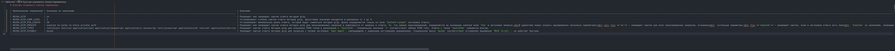
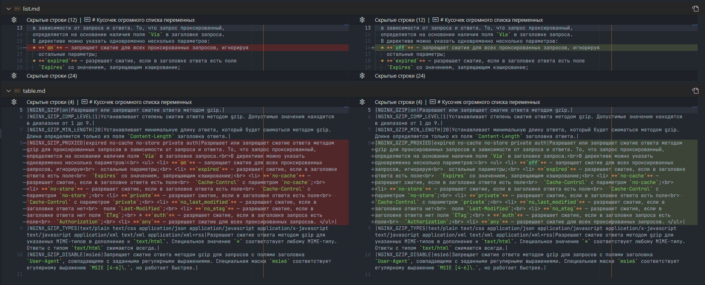
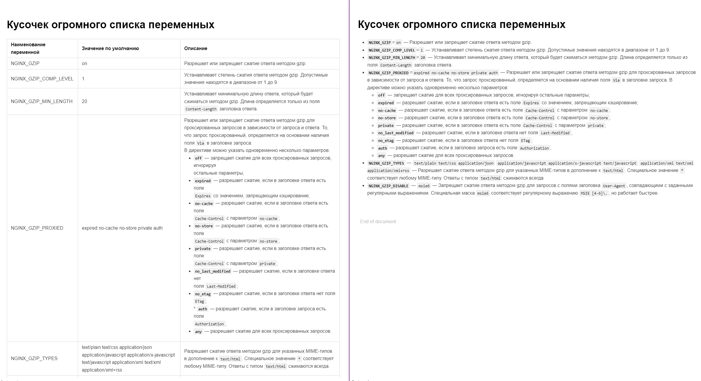
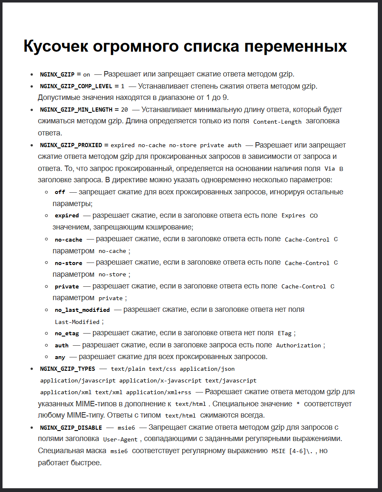
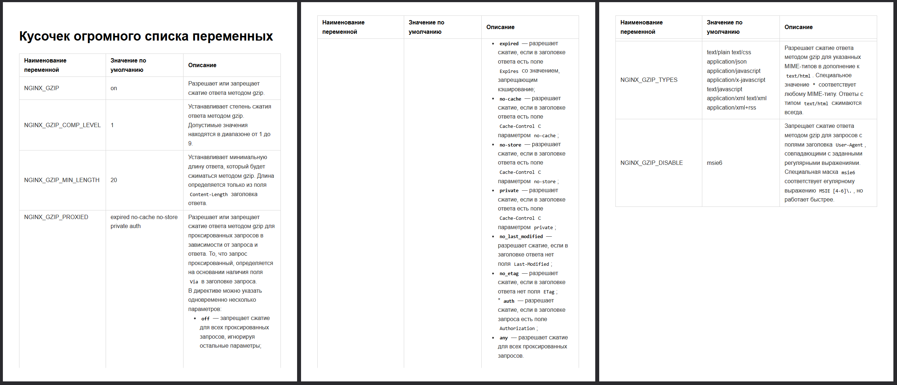

# Прекратите делать таблицы в Markdown

> Пожалуйста, перестаньте использовать таблицы в Markdown, особенно если они
> большие и сложные.

В пятницу ко мне подошел Андрей и с гордостью показал новую утилиту, которую
он разработал. Она генерирует документацию в Markdown на основе .env файла,
включая переменные, их значения и комментарии. Я, конечно, поздравил коллегу
с успехом и попросил посмотреть на результат. И тут меня ждал шок — таблица
в Markdown! Вы только представьте себе это!

Так начался холивар...

## Введение

Как известно, Markdown — это облегчённый язык разметки, созданный для
обозначения форматирования в простом тексте, при этом максимально сохраняя
его читаемость человеком и обеспечивая возможность машинного преобразования
в языки для продвинутых публикаций.

Ключевое слово здесь — читаемость, причем речь идет не о конечном рендере, а
о самом исходном документе. Иначе мы бы продолжали использовать HTML или
LaTeX для разметки, ведь «Он нам и на х й не нужон ваш Markdown!».

Markdown хорош именно тем, что его можно использовать начиная для создания
документации в репозитории проекта, которая затем:

* Используется в описании готового образа контейнера в реестре контейнеров,
* Публикуется с помощью MkDocs, Jekyll или другого решения как статичный
  HTML сайт,
* Конвертируется в PDF с помощью Puppeteer или Prince,
* При помощи Pandoc может превращаться в PDF или DOC в соответствии с ГОСТ
  стандартами,
* И прочие сценарии жизненного цикла ваших документов.

И во всех этих случаях документы могут выглядеть совершенно по-разному.

А всё потому, что Markdown не является стандартом, хотя так и кажется. Есть
CommonMark — это сейчас основа, с четкой
[спецификацией](https://spec.commonmark.org/), но в ней нет таблиц! Там
предлагается использовать только: `<table><tr><td><pre>**Hello
world**</pre></td></tr></table>` - где здесь читаемость?

Именно поэтому появилось множество различных стандартов, поддерживающих
таблицы вот в таком виде:

```md
| Item       | In Stock | Price |
| :--------- | :------: | ----: |
| Python Hat |   True   | 23.99 |
| SQL Hat    |   True   | 23.99 |
```

Это пожалуй кажется читаемым...

Альтернативных стандартов и расширений у Markdown множество. Вот лишь
небольшая часть популярных:

* [Markdown Extra](https://michelf.ca/projects/php-markdown/extra/)
* [MultiMarkdown](https://fletcherpenney.net/multimarkdown/)
* [R Markdown](https://rmarkdown.rstudio.com/)
* [GitHub Flavored Markdown](https://github.github.com/gfm/)
* [GitLab Flavored Markdown](https://docs.gitlab.com/ee/user/markdown.html)
* [Yandex Flavored Markdown](https://diplodoc.com/docs/ru/index-yfm)
* [PyMdown Extensions](https://facelessuser.github.io/pymdown-extensions/extensions/progressbar/)
* [VitePress Markdown Extensions](https://vitepress.dev/guide/markdown)
* [Front Matter](https://frontmatter.codes/docs/markdown)

Причем не все из этих стандартов одинаково работают с таблицами.

## А в чем проблема?

Андрей показывает мне, как работает его утилита и какой результат она
выдает.

На входе у нас такой `.env` файл:

```env
# Section 1
ENV_A=a # Описние a
ENV_B=b # Описние b
# Section 2
LOG_LEVEL=info # Описние log
```

А на выходе такой Markdown

<!-- prettier-ignore -->
```md
|Наименование переменной|Значение по умолчанию|Описание|
|:---|:---|:---|
|**Section 1**|||
|ENV_A|a|Описние a|
|ENV_B|b|Описние b|
|**Section 2**|||
|LOG_LEVEL|info|Описние log|
```

С этой задачей утилита справляется просто, но захотелось экспериментов более
приближенных к реальности. Я привел первый попавшийся под руку пример, где
бы мне реально пригодилась эта утилита. Там все переменные находятся в виде
списка:

 [list.md](assets/list.md)

После чего, попросил отрисовать готовый Markdown документ на основании моего
`.env`. Утилита прекрасно справилась с поставленной задачей:

 [table.md](assets/table.md)

Вопросов к утилите нет, на первый взгляд, всё кажется в порядке, но тут я
задался вопросом: насколько это действительно удобно и читабельно в исходном
виде, как это предполагалось в Markdown?

Мы долго спорили, доказывая друг другу, почему таблица — это хорошо или
плохо. Я не буду вдаваться в детали (они не пройдут цензуру), но далее —
сухой остаток, почему таблицы, на мой взгляд, это плохо.

## Проблемы

Как мы выяснили, CommonMark — это основной стандарт, на котором базируются и
который расширяют другие стандарты. Иногда они даже нарушают его. В самом
CommonMark нет поддержки таблиц с помощью внутренней разметки, только HTML,
и это не случайно. Таблицы — зло, и вот почему:

### Читаемость исходных файлов

Здесь всё просто, просто сравните два приведенных ниже блока кода.

```md
# Кусочек огромного списка переменных

* **`NGINX_GZIP`**=`on` —
  Разрешает или запрещает сжатие ответа методом gzip.
* **`NGINX_GZIP_COMP_LEVEL`**=`1` —
  Устанавливает степень сжатия ответа методом gzip.
  Допустимые значения находятся в диапазоне от 1 до 9.
* **`NGINX_GZIP_MIN_LENGTH`**=`20` —
  Устанавливает минимальную длину ответа, который будет сжиматься методом gzip.
  Длина определяется только из поля `Content-Length` заголовка ответа.
* **`NGINX_GZIP_PROXIED`**=`expired no-cache no-store private auth` —
  Разрешает или запрещает сжатие ответа методом gzip для проксированных запросов
  в зависимости от запроса и ответа. То, что запрос проксированный,
  определяется на основании наличия поля `Via` в заголовке запроса.
  В директиве можно указать одновременно несколько параметров:
  * **`on`** — запрещает сжатие для всех проксированных запросов, игнорируя
    остальные параметры;
  * **`expired`** — разрешает сжатие, если в заголовке ответа есть поле
    `Expires` со значением, запрещающим кэширование;
  * **`no-cache`** — разрешает сжатие, если в заголовке ответа есть поле
    `Cache-Control` с параметром `no-cache`;
  * **`no-store`** — разрешает сжатие, если в заголовке ответа есть поле
    `Cache-Control` с параметром `no-store`;
  * **`private`** — разрешает сжатие, если в заголовке ответа есть поле
    `Cache-Control` с параметром `private`;
  * **`no_last_modified`** — разрешает сжатие, если в заголовке ответа нет
    поля `Last-Modified`;
  * **`no_etag`** — разрешает сжатие, если в заголовке ответа нет поля `ETag`;
  * **`auth`** — разрешает сжатие, если в заголовке запроса есть поле
    `Authorization`;
  * **`any`** — разрешает сжатие для всех проксированных запросов.
* **`NGINX_GZIP_TYPES`** — `text/plain text/css application/json`
  `application/javascript application/x-javascript text/javascript`
  `application/xml text/xml application/xml+rss` —
  Разрешает сжатие ответа методом gzip для указанных MIME-типов в дополнение к
  `text/html`. Специальное значение `*` соответствует любому MIME-типу.
  Ответы с типом `text/html` сжимаются всегда.
* **`NGINX_GZIP_DISABLE`** — `msie6` —
  Запрещает сжатие ответа методом gzip для запросов с полями заголовка
  `User-Agent`, совпадающими с заданными регулярными выражениями.
  Специальная маска `msie6` соответствует регулярному выражению `MSIE [4-6]\.`,
  но работает быстрее.
```

```md
# Кусочек огромного списка переменных

|Наименование переменной|Значение по умолчанию|Описание|
|:---|:---|:---|
|NGINX_GZIP|on|Разрешает или запрещает сжатие ответа методом gzip.|
|NGINX_GZIP_COMP_LEVEL|1|Устанавливает степень сжатия ответа методом gzip. Допустимые значения находятся в диапазоне от 1 до 9.|
|NGINX_GZIP_MIN_LENGTH|20|Устанавливает минимальную длину ответа, который будет сжиматься методом gzip. Длина определяется только из поля `Content-Length` заголовка ответа.|
|NGINX_GZIP_PROXIED|expired no-cache no-store private auth|Разрешает или запрещает сжатие ответа методом gzip для проксированных запросов в зависимости от запроса и ответа. То, что запрос проксированный, определяется на основании наличия поля `Via` в заголовке запроса.<br>В директиве можно указать одновременно несколько параметров:<br> <ul> <li> **`on`** — запрещает сжатие для всех проксированных запросов, игнорируя<br>  остальные параметры;<br> <li> **`expired`** — разрешает сжатие, если в заголовке ответа есть поле<br>  `Expires` со значением, запрещающим кэширование;<br> <li> **`no-cache`** — разрешает сжатие, если в заголовке ответа есть поле<br>  `Cache-Control` с параметром `no-cache`;<br> <li> **`no-store`** — разрешает сжатие, если в заголовке ответа есть поле<br>  `Cache-Control` с параметром `no-store`;<br> <li> **`private`** — разрешает сжатие, если в заголовке ответа есть поле<br>  `Cache-Control` с параметром `private`;<br> <li> **`no_last_modified`** — разрешает сжатие, если в заголовке ответа нет<br>  поля `Last-Modified`;<br> <li> **`no_etag`** — разрешает сжатие, если в заголовке ответа нет поля `ETag`;<br> * **`auth`** — разрешает сжатие, если в заголовке запроса есть поле<br>  `Authorization`;<br> <li> **`any`** — разрешает сжатие для всех проксированных запросов. </ul>|
|NGINX_GZIP_TYPES|text/plain text/css application/json application/javascript application/x-javascript text/javascript application/xml text/xml application/xml+rss|Разрешает сжатие ответа методом gzip для указанных MIME-типов в дополнение к `text/html`. Специальное значение `*` соответствует любому MIME-типу. Ответы с типом `text/html` сжимаются всегда.|
|NGINX_GZIP_DISABLE|msie6|Запрещает сжатие ответа методом gzip для запросов с полями заголовка `User-Agent`, совпадающими с заданными регулярными выражениями. Специальная маска `msie6` соответствует егулярному выражению `MSIE [4-6]\.`, но работает быстрее.|
```

Теперь представьте себе, что это огромный файл с сотнями строк, а что если
потребуется изменить что-то вручную в этой таблице.

Не думаю, что найдется кто-то, кто сможет убедить меня, что второй вариант
читается проще. Особенно это поймут те, кто хоть раз открывал markdown в
терминале, особенно на виртуальной консоли с разрешением 640x480.

### Таблица может не отобразится

Если утилита, отображающая Markdown, поддерживает только CommonMark, вы не
получите красивой таблицы на выходе.

Не буду специально искать примеры, но приведу один из памяти. В реестре
контейнеров Quay используется CommonMark (по крайней мере, так было два года
назад). При сборке и публикации образа многие автоматически заливают туда
README.md, который теряет форматирование, если в нем есть таблицы в стиле
GFM. Проблема решалась конвертацией Markdown в HTML, который затем
публиковался как Markdown.

Да, это мелочь, но было неприятно узнать об этом при переносе публикации для
тысячи проектов.

### Ячейки неудобно форматировать

Если нужно разместить в ячейке таблицы список, переносы строк, блоки кода
или другое форматирование, всё может нарушиться. В таких случаях приходится
использовать HTML, что делает текст трудночитаемым и неудобным для
редактирования. Просто обратите внимание, каким путём собран список в рамках
одной из ячеек таблицы, сплошные `<ul>`, `<li>` и `<br>`, ведь переносы
строк там делать нельзя, всё сломается.

Попытки изобрести способы форматирования ячеек таблицы увеличивают риск
того, что какой-то рендер Markdown неправильно отобразит содержимое или
вообще его сломает.

### Это не стандарт

На вкус и цвет, как говорится, все фломастеры разные. Я никого не заставляю
использовать линтеры для проверки Markdown на соответствие стандартам.
Однако просто оставлю здесь отчёт от
[MarkdownLint](https://github.com/DavidAnson/markdownlint)



Для варианта со списком у меня нет картинок, потому что там просто не было
замечаний.

### Форматирование таблицы

Этот аргумент, пожалуй, можно считать притянутым за уши. Если я использую
таблицы, то стараюсь отформатировать их так, чтобы они были удобны для
чтения в любом виде.



Как видно из примера с исходным содержимымы, первый вариант без
форматирования менее удобен для восприятия по сравнению со вторым, но это ни
как не отражается на финальном рендере. Кстати, делать это вручную не
обязательно — для большинства редакторов и IDE такая функциональность
встроена или легко добавляется с помощью расширений.

Но что случится с нашей таблицей из примера?



К сожалению, двух мониторов не хватило, чтобы показать всю её ширину, а
полоса горизонтальной прокрутки намекает, что и четырёх мониторов могло бы
не хватить.

Вы можете возразить: «Не форматируй таблицу». Но если документ очень
большой, и я, поправив немного его верхнюю часть и не заметил таблицу далеко
внизу, то при сохранении автоматически запустится форматирование. После, я
без зазрений совести, коммичу и пушу правки, зная, что изменил лишь одну
строку в начале, но позже меня может ожидать неприятный сюрприз в виде
шумного коммита.

Да, это меня не оправдывает, но такая ситуация заслуживает обсуждения.

### Ширина строк

Для меня это, пожалуй, одна из главных причин, почему я против использования
широких строк в Markdown. Это касается как таблиц, так и общего
форматирования документа. Я стремлюсь укладываться в ширину 72/80 символов
на строку, а в крайнем случае — 132 символа.

Некоторые могут возразить, мол, эпоха перфокарт давно прошла, и с
современными 8K мониторами нет никаких проблем писать строки длиной от
начала до конца экрана. Но мой аргумент простой: это создает лишний шум в
коммитах и увеличивает нагрузку на ревьюера.

Вот пример тех же двух документов, где в теле изменился всего один параметр
с `on` на `off`. Посмотрите на этот дифф, какой из вариантов экономит время
на ревью?

```diff
diff --git a/list.md b/list.md
index 617c5b2..30b25ad 100644
--- a/list.md
+++ b/list.md
@@ -13,7 +13,7 @@
   в зависимости от запроса и ответа. То, что запрос проксированный,
   определяется на основании наличия поля `Via` в заголовке запроса.
   В директиве можно указать одновременно несколько параметров:
-  * **`on`** — запрещает сжатие для всех проксированных запросов, игнорируя
+  * **`off`** — запрещает сжатие для всех проксированных запросов, игнорируя
     остальные параметры;
   * **`expired`** — разрешает сжатие, если в заголовке ответа есть поле
     `Expires` со значением, запрещающим кэширование;
diff --git a/table.md b/table.md
index 4c53d05..843eb02 100644
--- a/table.md
+++ b/table.md
@@ -5,6 +5,6 @@
 |NGINX_GZIP|on|Разрешает или запрещает сжатие ответа методом gzip.|
 |NGINX_GZIP_COMP_LEVEL|1|Устанавливает степень сжатия ответа методом gzip. Допустимые значения находятся в диапазоне от 1 до 9.|
 |NGINX_GZIP_MIN_LENGTH|20|Устанавливает минимальную длину ответа, который будет сжиматься методом gzip. Длина определяется только из поля `Content-Length` заголовка ответа.|
-|NGINX_GZIP_PROXIED|expired no-cache no-store private auth|Разрешает или запрещает сжатие ответа методом gzip для проксированных запросов в зависимости от запроса и ответа. То, что запрос проксированный, определяется на основании наличия поля `Via` в заголовке запроса.<br>В директиве можно указать одновременно несколько параметров:<br> <ul> <li> **`on`** — запрещает сжатие для всех проксированных запросов, игнорируя<br>  остальные параметры;<br> <li> **`expired`** — разрешает сжатие, если в заголовке ответа есть поле<br>  `Expires` со значением, запрещающим кэширование;<br> <li> **`no-cache`** — разрешает сжатие, если в заголовке ответа есть поле<br>  `Cache-Control` с параметром `no-cache`;<br> <li> **`no-store`** — разрешает сжатие, если в заголовке ответа есть поле<br>  `Cache-Control` с параметром `no-store`;<br> <li> **`private`** — разрешает сжатие, если в заголовке ответа есть поле<br>  `Cache-Control` с параметром `private`;<br> <li> **`no_last_modified`** — разрешает сжатие, если в заголовке ответа нет<br>  поля `Last-Modified`;<br> <li> **`no_etag`** — разрешает сжатие, если в заголовке ответа нет поля `ETag`;<br> * **`auth`** — разрешает сжатие, если в заголовке запроса есть поле<br>  `Authorization`;<br> <li> **`any`** — разрешает сжатие для всех проксированных запросов. </ul>|
+|NGINX_GZIP_PROXIED|expired no-cache no-store private auth|Разрешает или запрещает сжатие ответа методом gzip для проксированных запросов в зависимости от запроса и ответа. То, что запрос проксированный, определяется на основании наличия поля `Via` в заголовке запроса.<br>В директиве можно указать одновременно несколько параметров:<br> <ul> <li> **`off`** — запрещает сжатие для всех проксированных запросов, игнорируя<br>  остальные параметры;<br> <li> **`expired`** — разрешает сжатие, если в заголовке ответа есть поле<br>  `Expires` со значением, запрещающим кэширование;<br> <li> **`no-cache`** — разрешает сжатие, если в заголовке ответа есть поле<br>  `Cache-Control` с параметром `no-cache`;<br> <li> **`no-store`** — разрешает сжатие, если в заголовке ответа есть поле<br>  `Cache-Control` с параметром `no-store`;<br> <li> **`private`** — разрешает сжатие, если в заголовке ответа есть поле<br>  `Cache-Control` с параметром `private`;<br> <li> **`no_last_modified`** — разрешает сжатие, если в заголовке ответа нет<br>  поля `Last-Modified`;<br> <li> **`no_etag`** — разрешает сжатие, если в заголовке ответа нет поля `ETag`;<br> * **`auth`** — разрешает сжатие, если в заголовке запроса есть поле<br>  `Authorization`;<br> <li> **`any`** — разрешает сжатие для всех проксированных запросов. </ul>|
 |NGINX_GZIP_TYPES|text/plain text/css application/json application/javascript application/x-javascript text/javascript application/xml text/xml application/xml+rss|Разрешает сжатие ответа методом gzip для указанных MIME-типов в дополнение к `text/html`. Специальное значение `*` соответствует любому MIME-типу. Ответы с типом `text/html` сжимаются всегда.|
 |NGINX_GZIP_DISABLE|msie6|Запрещает сжатие ответа методом gzip для запросов с полями заголовка `User-Agent`, совпадающими с заданными регулярными выражениями. Специальная маска `msie6` соответствует егулярному выражению `MSIE [4-6]\.`, но работает быстрее.|
```

И вот представьте, что мы обсуждали автоматическую генерацию документации с
описанием переменных, которая запускается как пред-коммитный хук. Если мы
меняем префикс переменной с `NGINX_` на `ANGIE_` или корректируем значения
по умолчанию в нескольких местах, какой из вариантов форматирования
документа вам было бы удобнее рассматривать как ревьюеру?

Кстати, в IDE это выглядит не намного лучше.



### Восприятие документа

К сожалению, невозможно напрямую управлять шириной колонок в таблицах
Markdown. Конечно, можно применять CSS и `<style>` для достижения нужного
вида, но ведь мы пишем документацию для людей, которые будут её читать.
Важно, чтобы документ был удобен для восприятия.



А как будет выглядеть такая же таблица, но с большим количеством колонок?
Или кто-то действительно считает использование пользовательского CSS в
Markdown нормальной практикой?

### Конвертация документа

Одной из целей Markdown является упрощение конвертации в различные форматы.
Рассмотрим, как Markdown преобразуется в PDF — один из наиболее
распространенных форматов. Чаще всего итоговый PDF будет иметь стандартный
размер шрифта и формат листа A4.

Ниже представлены примеры PDF-документов, созданных с помощью Puppeteer
(Chrome).

|             Список             |             Таблица             |
| :----------------------------: | :-----------------------------: |
|  |  |
|  [list.pdf](assets/list.pdf)   |  [table.pdf](assets/table.pdf)  |

Как видно, восприятие таблицы в PDF значительно ухудшается: три страницы
против одной. Если вам нужно создать документ, соответствующий ГОСТу или
брендбуку, вы, вероятно, будете использовать Pandoc с множеством
LaTeX-конструкций и параметров для достижения требуемого результата. Какова
вероятность того, что вы не столкнетесь с проблемами при работе с таблицами?
Если в документе используется HTML, шансы на успешное преобразование
уменьшаются, и это может стать настоящей головной болью, даже без учета
проблем с CSS, изменяющим ширину колонок.

### Переносимость

Учитывая все перечисленные проблемы, возникает вопрос: какова вероятность
того, что в случае обновления инструментов или перехода на новые решения
ваша ранее написанная документация окажется сломанной? В такой ситуации вам
предстоит выбор: редактировать всю документацию, чтобы она соответствовала
новым стандартам, или отказаться от обновлений и новых возможностей, чтобы
избежать потенциальных проблем.

## Выводы

Таблицы действительно являются полезным инструментом, но их применение
требует осторожности. Рекомендуется избегать слишком большого количества
колонок и не перегружать ячейки содержимым.

Также стоит проявлять осторожность при автоматической генерации таблиц.
Конечные пользователи могут столкнуться с проблемами восприятия и обвинить
вас, если их документ будет выглядеть неправильно.

По итогам нашего обсуждения Андрей реализовал в своей утилите возможность
генерации как списков, так и таблиц, сделав это настраиваемой опцией. Однако
он так и не сообщил, какое значение по умолчанию будет у этой опции:
`список` или `таблица` 🤔

К сожалению, я не нашел явных преимуществ использования таблиц в данном
контексте и возможно упустил какие-то минусы. Если у вас есть дополнительные
замечания или плюсы, о которых я не упомянул, пожалуйста, напишите об этом в
комментариях.

## Послесловие

Зачем я написал эту статью?
Всё просто: чтобы в случае очередного холивара я мог просто сослаться на
этот документ и не тратить часы на бессмысленные обсуждения.
